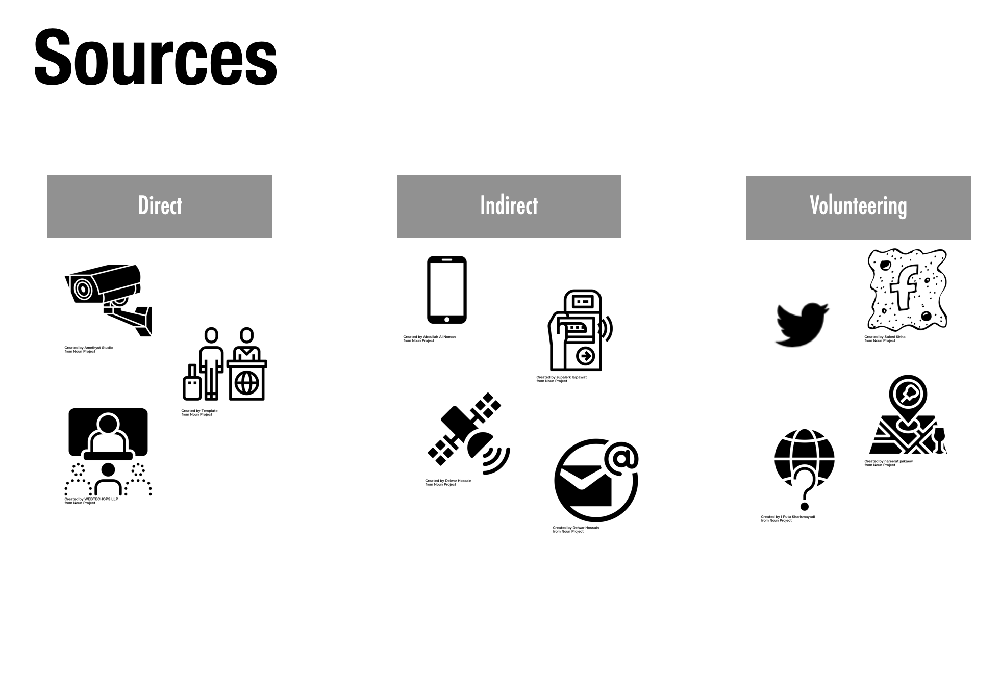

```{r setup, include=FALSE}
library(tint)
# invalidate cache when the package version changes
knitr::opts_chunk$set(tidy = FALSE, cache.extra = packageVersion('tint'), class.source = "col-source")
options(htmltools.dir.version = FALSE)
```

```{css, echo=FALSE}
.col-source {
  background-color: #E5E7E9;
  border: 3px #000000;
}
```

# Rise of data

We are experiencing a data revolution. Technological advances in computational power, storage and network platforms have enabled the emergence of *Big Data*. These technological innovations have facilitated the production, processing, analysis and storage of large volumes of digital data. Information that previously could not be stored, or used to be captured using analog devices can now be recorded digitally. We can now digitally generate, store, manage and analyse data that were previously very challenging to access, such as books, newspapers, photographs and art work. Mobile phones, social media platforms, satellites, emails, smart cards, CCTV and The Internet have all led to the current data revolution we are living in.

```{marginfigure}
Rowe, F. 2021. [Big Data and Human Geography](https://doi.org/10.31235/osf.io/phz3e). In: Demeritt, D. and Lees L. (eds) *Concise Encyclopedia of Human Geography*. Edward Elgar Encyclopedias in the Social Sciences series. 
```




Yet, the rise in data has posed major epistemological, methodological and ethical challenges (Rowe, 2021). Data on themselves are data enough. We need insights. To this end, *Data Science* has been instrumental in turning data resources into insight and understanding. *Data Science* is understood as the processes and techniques involved in this operation. *Big Data* are often unstructured, fragmented and hard to access due to privacy and confidentiality concerns. Significant data engineering is required, involving the use and design of specialised methods, software and expert knowledge, and linkage to other data sources, in order to use most *Big Data* sources (Arribas-Bel et al., 2021).

```{marginfigure}
Arribas-Bel, Dani, Mark Green, Francisco Rowe, and Alex Singleton. 2021. “Open Data Products-a Framework for Creating Valuable Analysis Ready Data.” *Journal of Geographical Systems*. 23 (4): 497–514. https://doi.org/10.1007/s10109-021-00363-5
```

# Geographic Data Science

Geographic data science is a subfield of research in geography and sits at the intersection between geography and data science (Singleton and Arribas-Bel, 2019). Geographic data science entails a bidirectional relationship between geography and data science. Geographic data science argues for the benefits of *Geography* for *Data Science* to address spatially explicit problems, especially because much *Big Data* are spatial. At the same time, *Geography* has much to gain from *Data Science*, particularly in the methodological and technical aspects of working with *Big Data*.

```{marginfigure}
Singleton, Alex, and Daniel Arribas-Bel. 2019. “Geographic Data Science.” *Geographical Analysis*. 53 (1): 61–75. https://doi.org/10.1111/gean.12194.
```

