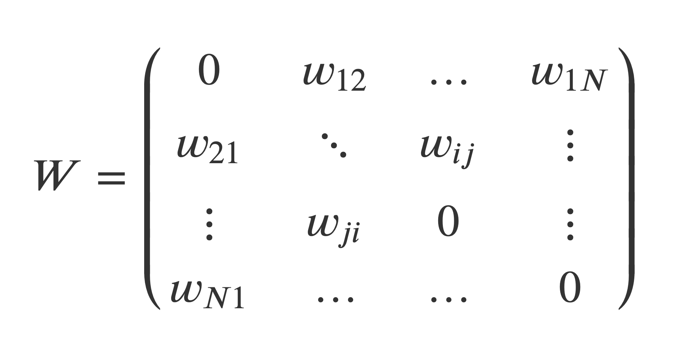

```{r setup, include=FALSE}
library(tint)
# handle spatial data
library(sf)
library(spdep)
# manipulate data
library(tidyverse)
library(lubridate)
# create maps
library(tmap)
# nice colour schemes
library(viridis) 
library(viridisLite)
# invalidate cache when the package version changes
knitr::opts_chunk$set(tidy = FALSE, cache.extra = packageVersion('tint'), class.source = "col-source")
options(htmltools.dir.version = FALSE)
```


```{css, echo=FALSE}
.col-source {
  background-color: #E5E7E9;
  border: 3px #000000;
}
```

```{marginfigure}
[**Back**](02-spatial-data.html) \
  
[**Next**](04-spatial_econometrics.html)
```

# Intuition

Now we will learn the intuition of how we can represent spatial relationships in practice.
We will explore a key concept of spatial analysis: *spatial weights matrices*.
Spatial weights matrices are structured sets of numbers that formally encode spatial associations between observations.

 

Key attributes of an spatial weight matrix:

-   Cell elements represent the extent of spatial interaction between two observations;\
-   The extent of spatial interaction is mediated by spatial proximity;

Spatial weight matrices can be created in various ways.
We will discuss the most commonly used in practice.

# Data

For now, we will only need our LA boundaries.

```{r}
# clean workspace
rm(list=ls())

# read shapefile
la_shp <- st_read("./data/Local_Authority_Districts_(May_2021)_UK_BFE_V3/LAD_MAY_2021_UK_BFE_V2.shp")

# simplify boundaries
la_shp_simple <- st_simplify(la_shp, 
                             preserveTopology =T,
                             dTolerance = 500) # .5km

# ensure geometry is valid
la_shp_simple <- sf::st_make_valid(la_shp_simple)

head(la_shp_simple[,c(2,3)])

```

# Building Spatial Weights

## Contiguity-based matrices

Contiguity weights matrices define spatial connection through the existence of common geographical boundaries.

### Queen

Based on the queen criteria, two spatial units are contiguous if they share a vortex (a single point) of their boundaries.

```{r}
wm_queen <- poly2nb(la_shp_simple, queen = TRUE)
summary(wm_queen)
```

> How do we interpret the outcome?

Finding the most connected area:

```{r}
la_shp_simple$LAD21NM[373]
```

Its neighbours:

```{r}
wm_queen[[373]]
```

Their names:

```{r}
la_shp_simple$LAD21NM[c(19,  48, 354, 356, 358, 359, 361, 363, 367, 369, 371, 374)]
```

Visualising the weights matrix:

```{r}
coords <- st_centroid(st_geometry(la_shp_simple))
plot(st_geometry(la_shp_simple), border="grey")
plot(wm_queen, coords, add = TRUE)
```

### Rook

The rook defines two observations as neighbours if they share some of their boundaries.
For irregular polygons, differences between the rook and queen definitions are minimal and tend to boil down to geocoding.
For regular polygons, such as rasters or grids, differences are more noticeable.

```{r}
wm_rook <- poly2nb(la_shp_simple, queen = FALSE)
summary(wm_rook)
```

> Have a go at interpreting and plotting the results.

## Distance-based matrices

Distance-based matrices define weights to each pair of observations as a function of their geographical proximity.
There are various distance-based matrices, but they share that same intuition.

### K-Nearest Neighbours

A approach is to define weights based on the distances between a reference observation and a the set of *k* observations; that is, the closest.
For more details see [this vignette](https://r-spatial.github.io/spdep/reference/knearneigh.html)

```{r}
col.knn <- knearneigh(coords, k=4)
head(col.knn[[1]], 5)
```

Displaying the network.

```{r}
plot(st_geometry(la_shp_simple), border="grey")
plot(knn2nb(col.knn), coords, add=TRUE)
```

### Distance Band

An alternative way to define is to draw a circle of certain radius and consider neighbours all observations (i.e. centroids) within that radious.

```{r}
wm_dist <- dnearneigh(coords, 0, 20000, longlat = TRUE)
wm_dist
```

```{r}
plot(st_geometry(la_shp_simple), border="grey")
plot(wm_dist, coords, add=TRUE)
```

## Row Standardised Weights Matrices

A spatial weights matrix with raw values (e.g. 1/0s) is rarely the best approach for analysis and some kind of transformation is required.

Let's use the queen definition to illustrate the example.

> Note: 'zero.policy = TRUE' allows listing non-neighbours.
> See what happens if you drop this argument or print \`rswm_queen'.
> If you have done that, you may be waiting for the answer.
> Well the answer is we have island in the dataset and the queen definition does not integrate these places very well.

The argument `Style=“W”` indicates that equal weights are assigned to neighbouring polygons, so they are row standardised: for a given polygon, sums across the columns and divide each cell by the total, to derive weights.

Let's see the weights for polygon 1:

```{r}
rswm_queen <- nb2listw(wm_queen, style = "W", zero.policy = TRUE)
rswm_queen$weights[1]
```

This unit has 2 neighbours and each is assigned a 0.5 of the total weight.

```{r eval=FALSE, include=FALSE}
file.edit(
  tint:::template_resources(
    'tint', '..', 'skeleton', 'skeleton.Rmd'
  )
)
```

```{r bib, include=FALSE}
# create a bib file for the R packages used in this document
knitr::write_bib(c('base', 'rmarkdown'), file = 'skeleton.bib')
```
